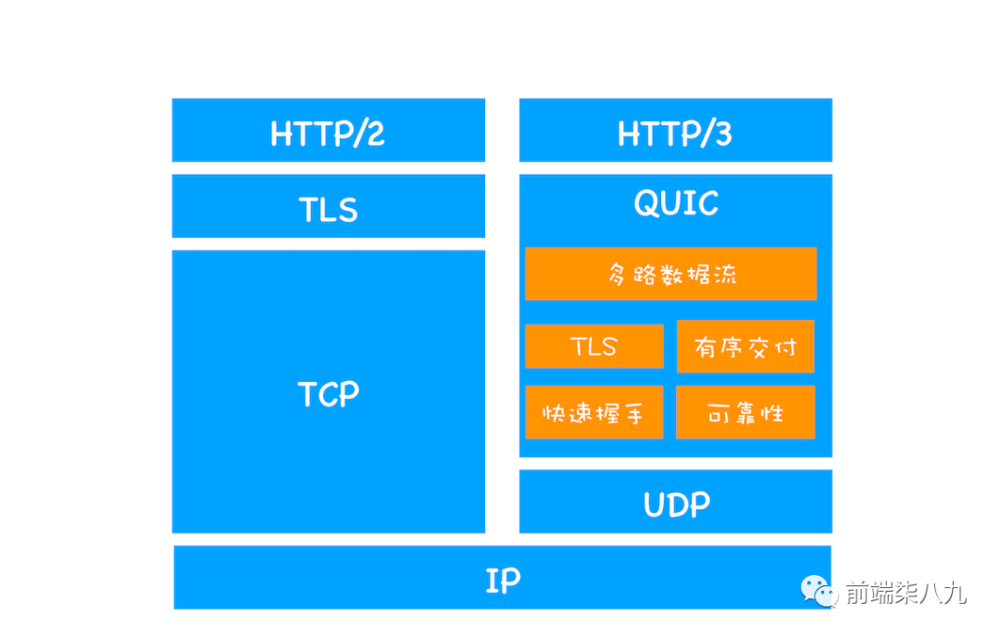

## HTTPS握手过程x
首先是tcp的三次握手建立连接
client发送client-random+支持的「加密算法集合」
server收到信息，返回「选择一个」加密算法+server-random+ 证书
client验证证书有效性，并用client-random+server-random生成pre-master通过服务器「公钥加密」 发送给server
server收到premaster，根据「约定的加密算法」对client-random+server-random+pre-master（解密）生成master-secret，然后发送预定成功
client收到生成同样的master-secert，对称加密秘钥传输完毕
## HTTP 2.0
HTTP 2.0 是 2015 年开发出来的标准，HTTP/2 的一个核心特性是使用了 多路复用技术，因此它可以 通过一个 TCP 连接来发送多个 URL 请求。多路复用技术能充分利用带宽，最大限度规避了 TCP 的慢启动所带来的问题。
1. 「头部压缩」
   由于 HTTP 1.1 经常会出现 User-Agent、Cookie、Accept、Server、Range 等字段可能会占用几百甚至几千字节，而 Body 却经常只有几十字节，所以导致「头部偏重」。
   HTTP 2.0 使用 HPACK 算法进行压缩
2. 多路复用 
   一个域名只使用一个 TCP 长连接来传输数据
   一个请求对应一个id，这样一个连接上可以有多个请求

## HTTP 3.0
  HTTP/3 选择了一个折衷的方法——UDP 协议，基于 UDP 实现了类似于 「TCP 的多路数据流」、「传输可靠性」等功能，我们把这套功能称为 「QUIC 协议」。
  
  